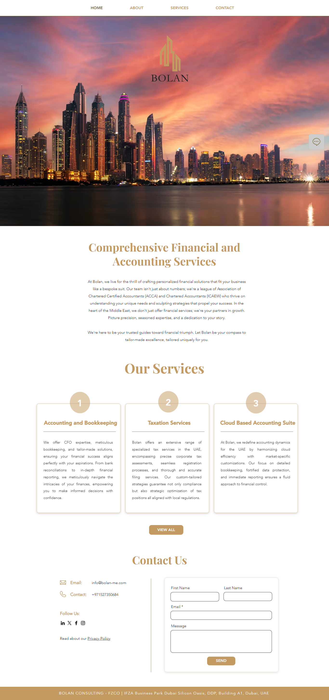
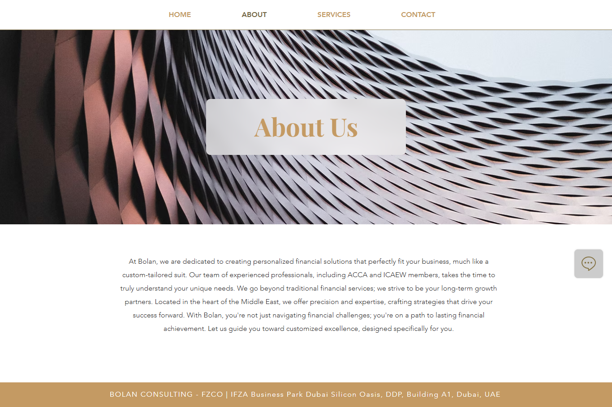
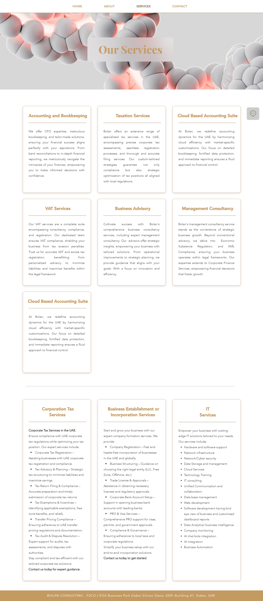
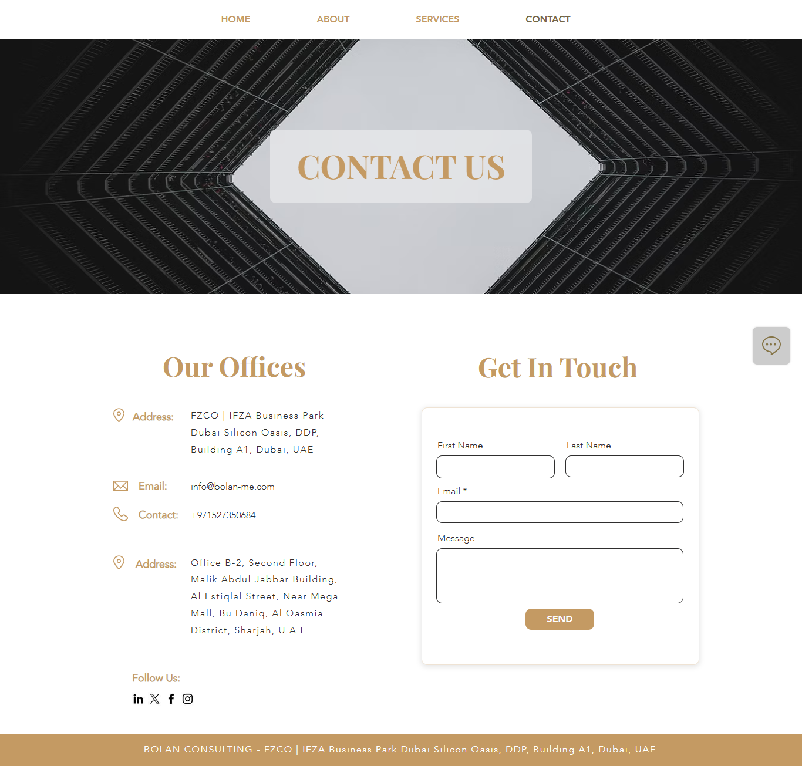

# wix-website-bolan
Live website: [https://www.bolan-me.com/]

## Project Overview
**Bolan** is a professional corporate website built using the **Wix platform**. The site presents an overview of Bolan’s business, highlighting their expertise, services, and strategic vision in the industry.

This website was designed to establish a credible digital presence.

## My Role & Contributions
- Built the entire website structure using **Wix Editor**
- Customized pages including **Homepage**, **About Us**, **Services**, and **Contact**
- Implemented a clean, modern, and professional UI
- Focused on user experience and mobile responsiveness
- Integrated contact forms for lead generation
- Ensured consistent branding and SEO fundamentals

## 🔧 Tools & Platforms
- **Wix Editor**
- **Wix Forms**
- **Wix SEO Tools**
- **Responsive Web Design Techniques**
- **Browser-based Testing (Chrome, Edge)**

## 🖼️ Website Preview

### Homepage

### About Us

### Services

### Contact Page

## 📍 Live URL
Visit the live website at:  
➡️ [www.bolan-me.com](https://www.bolan-me.com)

## 📬 Contact
For collaboration or custom Wix websites, feel free to reach out!  
**Ammara | Web Designer & Digital Consultant**
